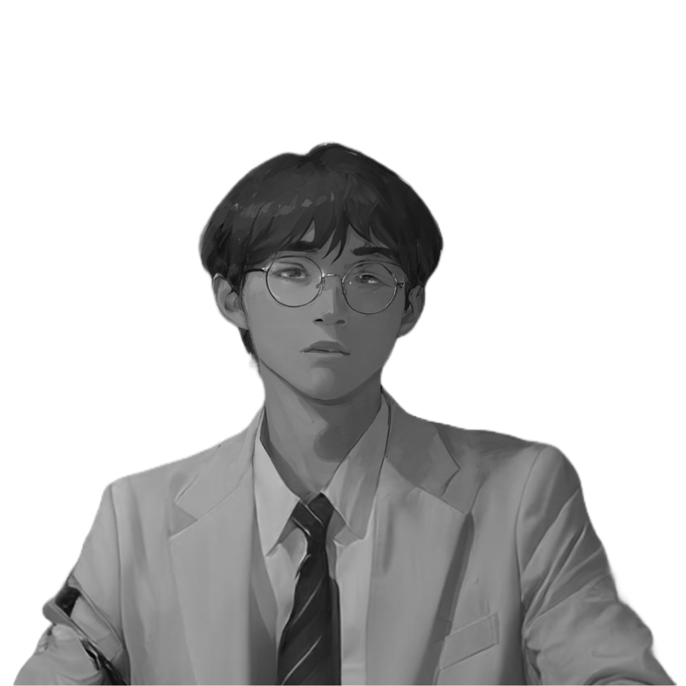

# MUZONE – Portfolio Web (Meet 5)

Website portfolio sederhana berbasis HTML, CSS, dan JavaScript. Menampilkan bagian Home (hero marquee + foto), About (deskripsi + sosial media), Skills (ikon teknologi + contribution graph), dan Contact (form email dengan modal konfirmasi), serta navigasi responsif.

## Fitur Utama

- Navigasi tetap di atas (desktop) dan bottom navigation (mobile)
- Hero marquee nama + foto profil full height
- Bagian About dengan link sosial (Instagram, YouTube, GitHub, Discord, LinkedIn)
- Grid Skills dengan efek hover (JS/TS/Node/React/Next/Express/Python/PostgreSQL/Supabase/Tailwind) dan GitHub contribution graph (Pacman)
- Form Contact dengan validasi sederhana, modal konfirmasi, dan pengiriman via mailto
- Desain responsif untuk layar kecil (≤768px)

## Demo & Pratinjau

- Buka langsung `index.html` di browser untuk melihat halaman
- Pratinjau cepat: 

## Struktur Proyek

```text
index.html     # Halaman utama
style.css      # Styling global dan responsif
script.js      # Logika modal dan aksi kirim email (mailto)
images/        # Aset gambar (profil, ikon)
```

## Teknologi

- HTML5, CSS3 (flexbox, media query, backdrop blur), JavaScript (vanilla)
- Tidak memerlukan dependency atau build tools

## Cara Menjalankan (Lokal)

Pilihan 1: klik dua kali `index.html` untuk membuka di browser.

Pilihan 2 (disarankan): gunakan Live Server di VS Code agar auto-reload.

- Install ekstensi “Live Server”
- Klik kanan `index.html` → “Open with Live Server”

## Personalisasi Cepat

- Ubah nama dan judul halaman: `index.html`
  - Ganti teks marquee dan `<title>` (sebaiknya lebih deskriptif dari “Document”)
- Ganti foto profil: `images/profile.png`
- Perbarui tautan sosial: bagian About di `index.html`
- Ubah email tujuan: `script.js` (variabel `mailtoLink`) dan/atau atribut `mail-to` pada form
- Atur daftar skills atau warna hover: di `index.html` (ikon) dan `style.css`

## Catatan Teknis & Peningkatan

- Aksesibilitas: tombol konfirmasi modal sudah keyboard-friendly, namun bisa ditambah fokus trap dan ARIA role pada modal
- SEO: tambahkan meta description dan judul halaman yang jelas; pertahankan `lang` dan `viewport`
- Kinerja: teks marquee berukuran sangat besar (30rem); pertimbangkan `clamp()` agar lebih adaptif

## Lisensi

© 2025 MUZAAQI. Lisensi belum ditentukan.

## Kredit

- Ikon SVG di-embed langsung dari Bootstrap Icons/brand shapes dan logo teknologi
- Contribution graph diambil dari repositori GitHub `muzaaqi/muzaaqi`
